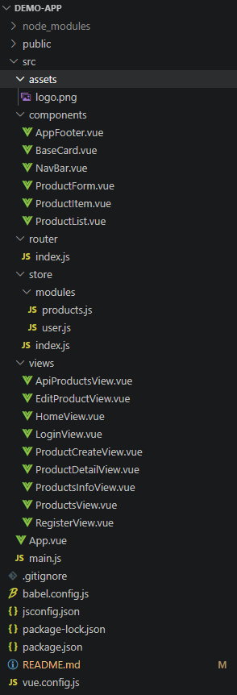
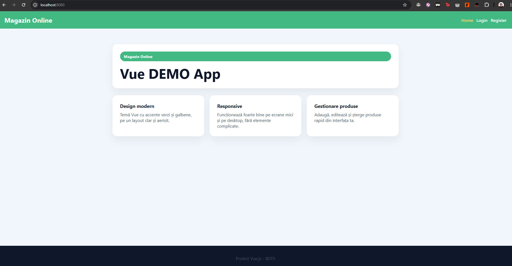
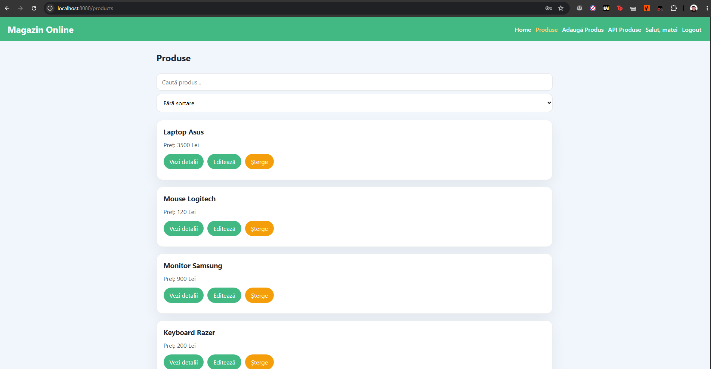
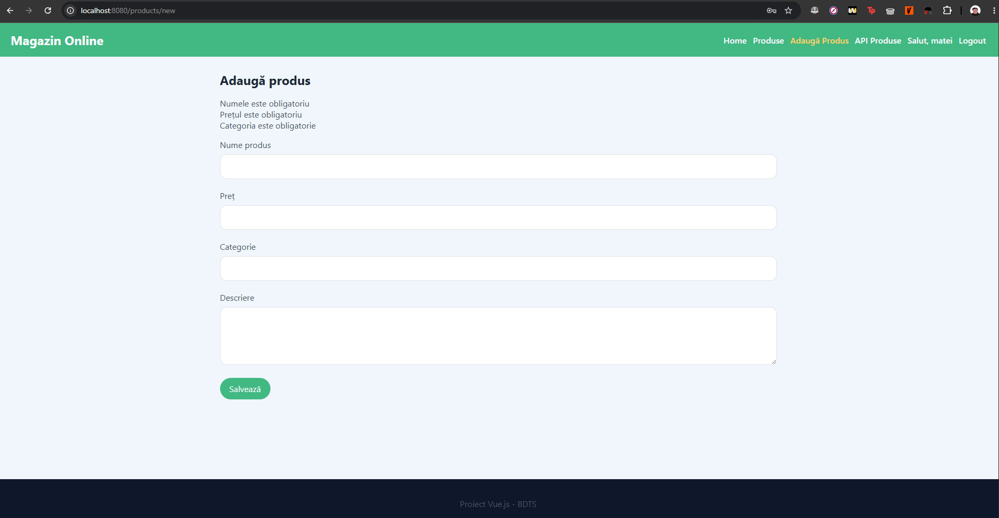
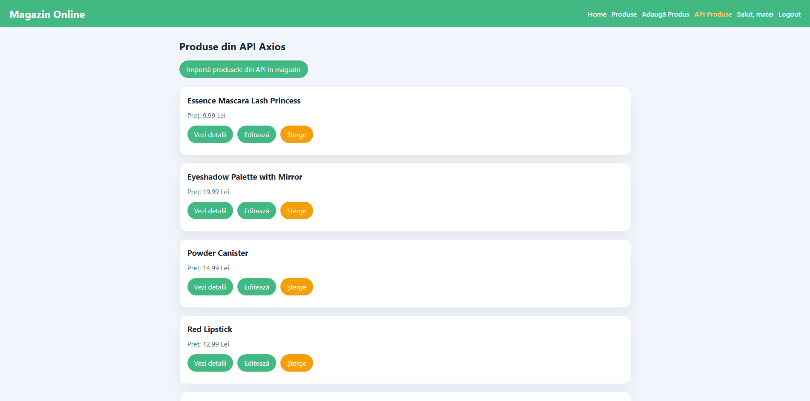

# Magazin Online Vue Demo

## Descrierea aplicației
Această aplicație este un magazin online DEMO construit cu Vue.js 3, Vuex și Vue Router special pentru evaluare la materia Introducere in Vue.JS. Aplicația a fost construită astfel încât să fie posibilă demonstrarea stăpânirii conceptelor introductive în Vue. 

## Tema aleasă
- Magazin Online

## Structura componentelor
### Componente principale
- `src/App.vue` - layout global, include `NavBar`, `router-view` și `AppFooter`
- `src/components/NavBar.vue` - bara de navigare principală
- `src/components/AppFooter.vue` - footer simplu
- `src/components/ProductForm.vue` - formularul de adăugare/editare produs
- `src/components/ProductList.vue` - listă de produse
- `src/components/ProductItem.vue` - card produs individual
- `src/components/BaseCard.vue` - card generic pentru prezentare

### Views
- `src/views/HomeView.vue` - pagina principală de prezentare
- `src/views/ProductsView.vue` - afișează lista de produse
- `src/views/ProductCreateView.vue` - formular de adăugare produs
- `src/views/EditProductView.vue` - editare produs existent
- `src/views/ProductDetailView.vue` - detalii produs
- `src/views/LoginView.vue` - formular de autentificare
- `src/views/RegisterView.vue` - formular de înregistrare
- `src/views/ApiProductsView.vue` - import produse din API axios

### Store
- `src/store/index.js` - configurare Vuex
- `src/store/modules/products.js` - gestiunea produselor
- `src/store/modules/user.js` - gestiunea utilizatorilor

## Funcționalități implementate
- afișare listă produse
- adăugare produs nou
- editare produs existent
- ștergere produs
- vizualizare detalii produs
- funcționalitate de login/register (simplă)
- păstrare utilizator curent în `localStorage` pentru sesiune persistată
- import produse din API folosind `axios`
- filtrare și sortare produse în funcție de criterii
- design responsive pentru mobil și desktop

## Cum rulezi proiectul
1. Instalează dependențele:
   ```bash
   npm install
   ```
2. Rulează serverul de dezvoltare:
   ```bash
   npm run serve
   ```
3. Deschide aplicația în browser la:
   ```text
   http://localhost:8080
   ```

## Capturi de ecran

Structura proiectului:



Pagina principală (Home):



Lista de produse:



Formularul de adăugare produs:



Import produse din API:




